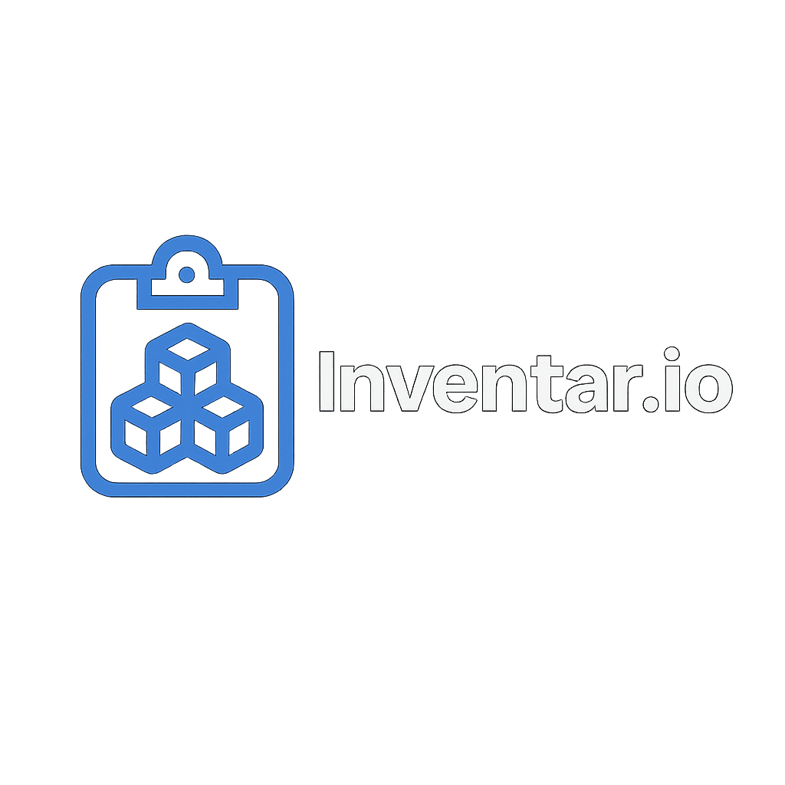
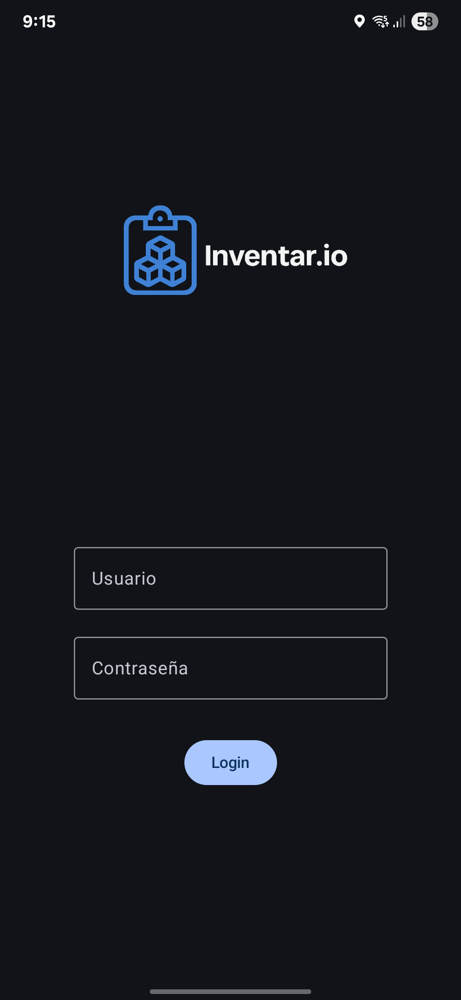
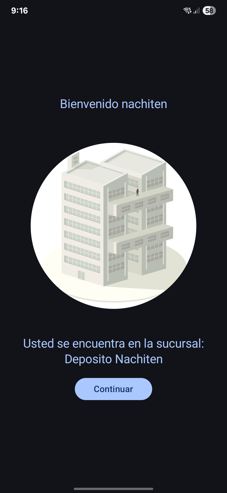
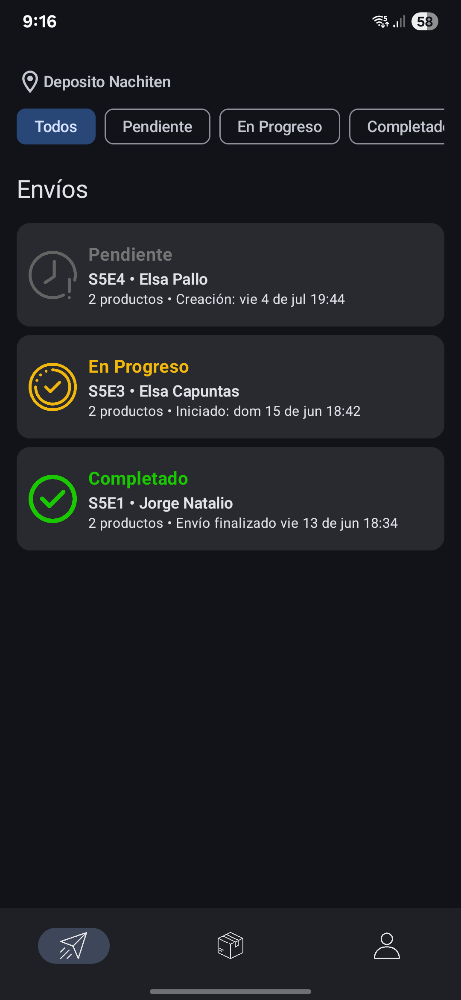
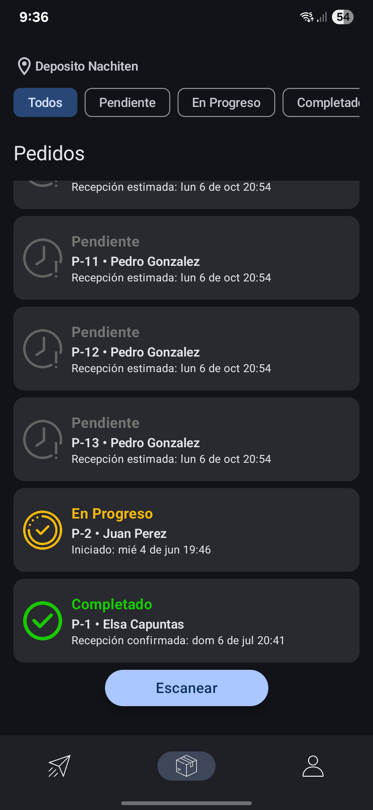
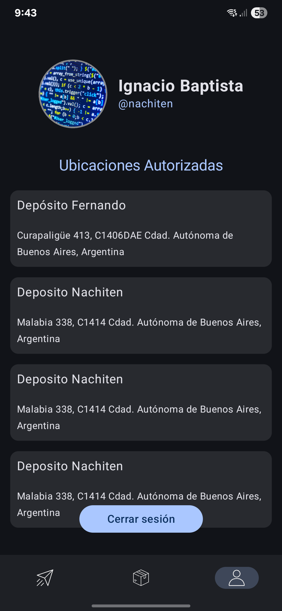
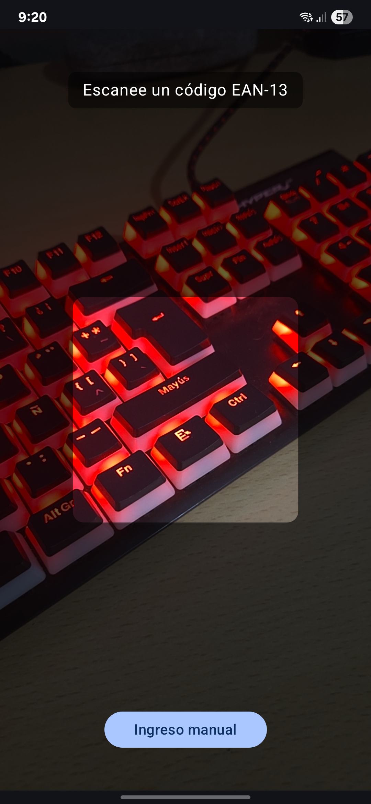

# 📦 Inventar.io

<p align="center">
    
</p>

**Inventar.io** es una aplicación móvil diseñada para facilitar la gestión de inventarios en depósitos, almacenes y centros logísticos. Con una interfaz intuitiva, funcionalidades modernas como escaneo de códigos con cámara, y un sistema para gestionar pedidos y órdenes, **Inventar.io** es la solución perfecta para llevar el control de tus productos.

---

## 🚀 Características Principales

- 🔐 **Autenticación segura**: Iniciá sesión con tu cuenta para acceder a alguno de tus depósitos.
- 📦 **Gestión de pedidos y órdenes**: Escaneá un QR y procesá una orden, o comenzá a escanear códigos de barra para ir procesando pedidos.
- 📷 **Escaneo inteligente**: Usá la cámara del dispositivo para escanear códigos de productos u órdenes de entrada.
- 🔄 **Sincronización en tiempo real**: Los cambios de stock realizados por los pedidos y órdenes se actualizan en tiempo real.
- 🌐 **Multi-depósito**: La aplicación funciona para distintos depósitos en base a tu ubicación física.

---

## 📸 Capturas de Pantalla

### 🔑 Login


### 🏠 Bienvenida


### 📦 Envios


### 📦 Pedidos


### 👨‍💼 Usuario


### 📷 Escaneo con Cámara


**Para ver todos los screenshots ingresar a `/docs/screenshots`**

---

## 🛠️ Tecnologías Utilizadas

- **Kotlin** para Android
- **Java** para el Backend
- **PostgreSQL** para persistencia en el backend
- **Jetpack Compose**
- **MVVM Architecture**
- **Material Design 3**

---

## 🖥️ Backend

Para ejecutar el backend de **Inventar.io**, utilizá el siguiente _Gradle task_:

```bash
./gradlew dockerComposeUp
```

Este comando inicializará automáticamente todos los servicios necesarios, incluyendo la base de datos, a través de Docker Compose. Una vez finalizado, el backend estará listo para recibir conexiones desde la aplicación móvil.

---

## 📱 Frontend

Para que la app móvil se conecte correctamente al backend local, seguí estos pasos:

1. Abrí el archivo local.properties ubicado en la raíz del proyecto Android.

2. Añadí (o modificá) la siguiente línea, reemplazando la IP según tu entorno:
    ```
    API_BASE_URL=http://192.168.1.106:8080
    ```

3. Recompilá la aplicación para aplicar los cambios.

ℹ️ Importante: Asegurate de que el dispositivo Android (físico o emulador) tenga acceso a la IP indicada y que no haya firewalls bloqueando el puerto.

---

## 📝 Licencia

Este proyecto está bajo la Licencia MIT. Ver el archivo [LICENSE](./LICENSE) para más detalles.

---

> Made with ❤️ by UTN FRBA <3